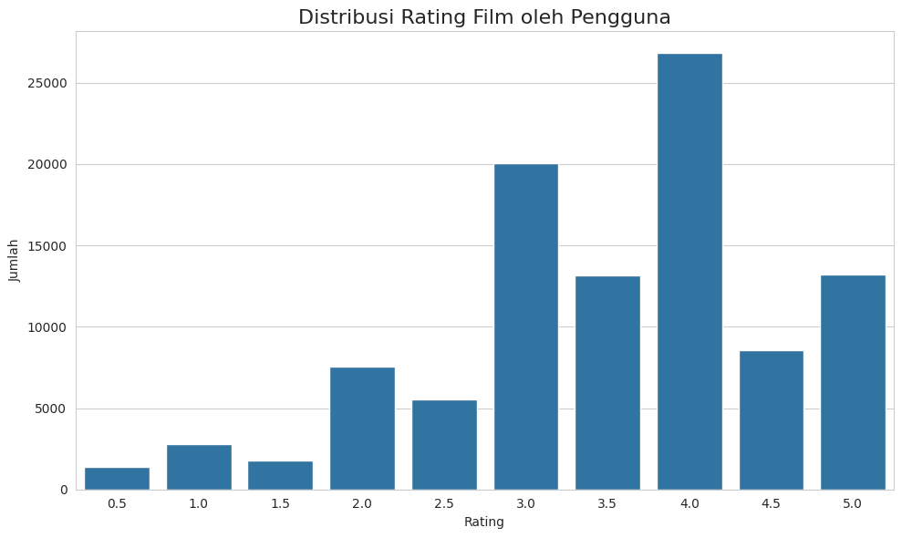

# Laporan Proyek Machine Learning - Muhammad Fathi Radithya

## Domain Proyek

### Latar Belakang
Dalam beberapa tahun terakhir, jumlah konten digital yang tersedia secara daring meningkat secara eksponensial, khususnya dalam industri hiburan seperti film dan serial televisi. Kondisi ini mendorong kebutuhan akan sistem rekomendasi yang cerdas untuk membantu pengguna menemukan konten yang sesuai dengan preferensi mereka. Kedua pendekatan yang populer dalam membangun sistem rekomendasi adalah Content-Based Filtering dan Collaborative Filtering. Content-Based Filtering merekomendasikan item berdasarkan kemiripan fitur dengan item lain, sedangkan pendekatan Collaborative Filtering, khususnya yang berbasis matrix factorization dan embedding neural network, telah terbukti efektif dalam menangkap pola perilaku pengguna yang kompleks (Koren et al., 2009). Dengan memanfaatkan interaksi pengguna sebelumnya dalam bentuk rating, sistem dapat memprediksi preferensi pengguna terhadap item yang belum pernah mereka lihat.

**Referensi:**
- Koren, Y., Bell, R., & Volinsky, C. (2009). *Matrix Factorization Techniques for Recommender Systems*. IEEE Computer, 42(8), 30–37.

##  Business Understanding

### Problem Statements: 
- Banyaknya pengguna yang tidak dapat menemukan film berdasarkan preferensi mereka.
- Rekomendasi film yang tidak dipersonalisasi berdasarkan preferensi pengguna.
- Bagaimana cara memastikan sistem rekomendasi cukup akurat untuk meningkatkan kepuasan pengguna?

### Goals: 
- Memprediksi dan merekomendasikan film yang relevan bagi pengguna berdasarkan data historis rating dan metadata film.
- Menyediakan dua pendekatan berbeda yang dapat dibandingkan dan saling melengkapi: berbasis konten dan berbasis kolaborasi.
- Memberikan hasil rekomendasi yang dapat diukur tingkat keakuratannya secara kualitatif dan kuantitatif.

### Solution Statement:  
- Membuat model Content-Based Filtering, menggunakan TF-IDF dan Cosine Linearity, memanfaatkan fitur seperti genre.
- Membuat model berdasarkan Collaborative Filtering, menggunakan Neural Network RecommenderNet.
- Menggunakan metrik evaluasi RMSE (Root Mean Squared Error), Precision, Recall, dan relevansi kualitatif rekomendasi untuk mengukur performa model.
      
## Data Understanding

### Sumber Dataset
[MovieLens Latest Datasets (Small)](https://grouplens.org/datasets/movielens/latest/)

### Deskripsi Dataset
Dataset terdiri dari empat dataset, namun dalam proyek hanya menggunakan dua dataset utama:

1. movies.csv
Dataset terdiri dari 9742 baris data dan 3 kolom fitur:
    - `movieId`: ID unik untuk tiap film. 
    - `title`: Judul film beserta tahun rilis.
    - `genres`: Daftar genre untuk setiap film, dipisahkan dengan tanda `|`.

2. ratings.csv
Dataset terdiri dari 100836 baris data dan 4 kolom fitur.
    - `userId`: ID unik pengguna.
    - `movieId`: ID film yang dinilai.
    - `rating`: Nilai rating (antara 0.5 hingga 5.0).
    - `timestamp`: Waktu rating diberikan (dalam format UNIX timestamp).


### Tahapan Lanjutan:
- Pemeriksaan struktur data (jumlah data, tipe variabel).
```
movies.info()
ratings.info()
movies.head()
ratings.head()
```
- Menangani Missing Value
```
all_movies_name.isnull().sum()
```
Dilakukan setelah join dataset `movies` dan `ratings`. Dari 100836 baris dan 6 kolom pada dataframe `all_movies_name` tidak terdapat kolom yang memiliki missing value, menunjukkan dataframe lengkap untuk seluruh datanya setelah penggabungan.

- Exploratory Data Analysis
     - Distribusi Genre Film
	  
	Berdasarkan persebaran plot genre film dalam dataset movies, dapat disimpulkan bahwa Film dengan genre `Drama` dan `Comedy` paling umum, mungkin menunjukkan minat pengguna yang tinggi.
     - Distribusi Rating Film
	  
	Berdasarkan persebaran plot rating film dalam dataset `ratings`. Sebagian besar rating berada diantara `3.0` dan `4.0`, dengan rating `5.0` setelahnya. Hal ini menunjukkan pengguna yang cenderung memiliki opini positif terhadap film yang mereka tonton.

## Data Preparation
Tahapan yang dilakukan:
1.  Content-Based Filtering
- Penggabungan Dataframe
```
all_movies_name = pd.merge(ratings, movies, on='movieId', how='left')
```
Preprocessing data dilakukan sebagai persiapan TF-IDF vectoring, dimana dapat menghasilkan dataframe `all_movies_name` yang lebih lengkap dan fleksibel untuk preparation berikutnya.

- Membersihkan Dataframe
```
all_movies_name = all_movies_name[all_movies_name['genres'] != '(no genres listed)']
```
Sebelumnya pada Univariate Data Exploration, diketahui ada sampel kecil dari film dalam dataset yang tidak memiliki genre, atau `(no genres listed)`. Dalam tahap preparation, dilakukan pengecekan untuk mengetahui dimana saja dan apa yang bisa kita lakukan untuk mengatasinya.

Dalam pengecekan, ditemukan beberapa judul yang tidak memiliki masukan genre, sebagai contoh, `Green Room (2015)` dan `Pirates of the Caribbean: Dead Men Tell No Tales (2017)`. Hal berikut disayangkan, namun dikarenakan jumlah judul yang insignifikan dibandingkan dengan keseluruhan, maka akan dilakukan penghapusan saja.

Selain itu, genre adalah fitur penting dalam sistem rekomendasi, digunakan sebagai fitur utama dalam model berbasis konten seperti TF-IDF vectorization. Data tanpa genre berarti tidak bisa diwakili dalam ruang fitur, dan akan menyebabkan masalah dalam vektorisasi atau prediksi model.

Setelah proses penghapusan, terjadi pengurangan baris dalam dataframe `all_movies_name` dari 100836 menjadi 100789 atau pengurangan sebesar <1%.

- TF-IDF Vectoring
	```
	from sklearn.feature_extraction.text import TfidfVectorizer
 
    tfidf_vectorizer = TfidfVectorizer()
    tfidf_vectorizer.fit(data['genres']) 
 
    tfidf_vectorizer.get_feature_names_out()
    
    tfidf_matrix = tfidf_vectorizer.fit_transform(data['genres']) 
    tfidf_matrix.shape
	```
	 Melakukan transformasi teks genre menjadi representasi numerik menggunakan TF-IDF (Term Frequency-Inverse Document Frequency).
    - Vektor TF-IDF berhasil menangkap 19 genre unik dari data teks yang telah diproses (processed_genres).
        - Genre seperti `sci-fi` dan `film-noir` sebelumnya telah ditransformasikan menjadi `sci_fi` dan `film_noir` agar tidak terpecah saat tokenisasi.
    - Matriks TF-IDF memiliki 9690 baris (film) dan 19 kolom (genre).
        - Setiap baris merepresentasikan sebuah film, dan setiap kolom menyatakan nilai bobot TF-IDF dari sebuah genre untuk film tersebut.
    - Jumlah film (9690) adalah hasil akhir setelah proses penghapusan film dengan genre (no genres listed) yang dilakukan sebelumnya. Film tanpa genre tidak dapat direpresentasikan secara akurat dalam sistem rekomendasi berbasis konten, sehingga dihapus dari data pelatihan.
    - Dari total awal 9742 film, hanya 9690 yang memiliki genre yang valid, dan digunakan untuk membentuk representasi vektor TF-IDF.
	
    ```
    tfidf_matrix.todense()
    
    pd.DataFrame(
        tfidf_matrix.todense(), 
        columns=tfidf_vectorizer.get_feature_names_out(),
        index=data.movie_title
    ).sample(19, axis=1).sample(10, axis=0)
    ```
    Berdasarkan hasil vektor matriks TF-IDF, menghasilkan hubungan `movie_title` dengan `genres` dalam range [0,1]. Semakin mendekati nilai dengan 1, maka semakin kuat korelasinya.

- Normalisasi Teks
```
all_movies_name['processed_genres'] = (
    all_movies_name['genres']
    .str.replace(r'\|', ' ', regex=True)
    .str.replace('-', '_', regex=True)
    .str.lower()
)
```
Normalisasi teks dilakukan untuk mempersiapkan data genre agar dapat digunakan dalam proses vektorisasi seperti **TF-IDF**, yang memerlukan input dalam bentuk teks bersih dan konsisten.

- `.str.replace(r'\|', ' ', regex=True)`: Mengganti pemisah antar genre dari '|' menjadi spasi.
- `.str.replace('-', '_', regex=True)`: Mengganti pemisah dalam genre dari '-' menjadi underscore '_', mencegah genre majemuk seperti 'Sci-Fi' atau 'Film-Noir' terpecah menjadi dua kata saat tokenisasi.

- Menghapus Nilai Duplikat
```
preparation_tfidf = all_movies_name.drop_duplicates('movieId')
```
Sistem rekomendasi berbasis konten seperti TF-IDF hanya memerlukan satu representasi unik untuk setiap item (dalam hal ini, film). Namun, dataset `all_movies_name` yang merupakan hasil penggabungan antara `ratings` dan `movies` bersifat redundan, karena satu film bisa muncul berkali-kali (setiap kali di-rating oleh pengguna berbeda).

- Ekstraksi Fitur dan Metadata
```
movie_id = preparation_tfidf['movieId'].tolist()
movie_title = preparation_tfidf['title'].tolist()
movie_genre = preparation_tfidf['processed_genres'].tolist()
```
Esktraksi fitur dilakukan untuk mengambil data penting dari DataFrame `preparation_tfidf` dan mengubahnya menjadi list Python agar dapat digunakan dalam proses vektorisasi dan pemodelan.

2. Collaborative Filtering
- Encoding ID
```
user_ids = df['userId'].unique().tolist()
movie_ids = df['movieId'].unique().tolist()
 
user_to_user_encoded = {x: i for i, x in enumerate(user_ids)}
movie_to_movie_encoded = {x: i for i, x in enumerate(movie_ids)}
 
user_encoded_to_user = {i: x for i, x in enumerate(user_ids)}
movie_encoded_to_movie = {i: x for i, x in enumerate(movie_ids)}

df['user'] = df['userId'].map(user_to_user_encoded)
df['movie'] = df['movieId'].map(movie_to_movie_encoded)
```
Encoding ID dilakukan untuk mengurutkan `userId` dan `movieId` menjadi indeks berurut. Hal ini digunakan sehingga memudahkan dalam modeling.

- Standarisasi
```
y = df['rating'].apply(lambda x: (x - min_rating) / (max_rating - min_rating)).values
```
`rating` dinormalisasi ke rentang 0–1 menggunakan rumus min-max scaling agar lebih stabil saat pelatihan model (y). 

- Menghapus Kolom yang Tidak Digunakan
```
df = df.drop(columns=['timestamp'])
```
Menghapus kolom `timestamp` karena tidak berkontribusi dalam proses rekomendasi berbasis rating.

- Data Shuffling
```
df = df.sample(frac=1, random_state=42)
```
Melakukan pengacakan data dengan `sample(frac=1)` untuk memastikan distribusi data lebih merata dan menghindari bias urutan saat pelatihan model. Pengacakan dilakukan secara konsisten menggunakan `random_state=42`.

- Data Splitting
```
train_indices = int(0.8 * df.shape[0])
x_train, x_val, y_train, y_val = (
    x[:train_indices],
    x[train_indices:],
    y[:train_indices],
    y[train_indices:]
)
 
print(x, y)
```
Membagi dataset dibagi menjadi dua bagian: 80% untuk pelatihan (x_train, y_train) dan 20% untuk validasi (x_val, y_val) untuk menguji performa model pada data yang belum terlihat.

## Modeling and Results
Model yang digunakan:
1. Content-Based Filtering :
    ```
    cosine_sim = cosine_similarity(tfidf_matrix)
    
    cosine_sim_df = pd.DataFrame(cosine_sim, index=data['movie_title'], columns=data['movie_title'])
    print('Shape:', cosine_sim_df.shape)
 
    cosine_sim_df.sample(5, axis=1).sample(10, axis=0)
    ```
    Cosine Similarity dilakukan untuk mengukur korelasi antara `movie_title` dalam skala [0,1], semakin mendekati 1, semakin kuat korelasinya.
    
    ```
    def movie_recommendations(judul_film, similarity_data=cosine_sim_df, items=data[['movie_title', 'genres']], k=5):
    index = similarity_data.loc[:,judul_film].to_numpy().argpartition(
        range(-1, -k, -1))
    
    closest = similarity_data.columns[index[-1:-(k+2):-1]]
    closest = closest.drop(judul_film, errors='ignore')
 
    return pd.DataFrame(closest).merge(items).head(k)
    ```
    - Mengambil skor kemiripan dari film tersebut ke semua film lain.
    - Memilih `k`, disini 5, film yang paling mirip (dengan skor cosine similarity tertinggi).
    - Menyaring hasil agar tidak merekomendasikan film itu sendiri.
    - Mengembalikan daftar film beserta genre-nya sebagai rekomendasi.
  
### Hasil Modeling:
- Precision & Recall
  - `Precision@5`: 0.0424 (4.24%)
  - `Recall@5`: 0.0028 (0.28%)

- Kualitatif Relevansi
#### Target
| No | Movie Title       | Genres                          | 
|----|-------------------|---------------------------------|
| 1  | Your Name. (2016) | animation drama fantasy romance |

#### Prediksi
| No | Movie Title                                             | Genres                  | 
|----|---------------------------------------------------------|-------------------------|
| 1  | Tale of Princess Kaguya, The (Kaguyahime no monogatari) | animation drama fantasy |
| 2  | Waking Life (2001)                              	       | animation drama fantasy |
| 3  | Belladonna of Sadness (1973)                            | animation drama fantasy |
| 4  | Idiots and Angels (2008)                                | animation drama fantasy |
| 5  | Angel's Egg (Tenshi no tamago) (1985)                   | animation drama fantasy |

    
### Kelebihan Model:
- Tidak bergantung pada data pengguna lain, dapat memberikan rekomendasi meskipun hanya ada satu pengguna.
- Bekerja baik untuk pengguna baru selama ada data konten (genre, deskripsi, dll), sistem dapat merekomendasikan item baru.
- Transparan dan dapat dijelaskan, menggunakan rekomendasi berdasarkan kemiripan fitur konten, sehingga mudah ditelusuri alasannya.
- Tidak terdampak cold-start untuk item baru, selama memiliki fitur yang diketahui bisa langsung direkomendasikan.
### Kekurangan Model:
- Terbatas pada fitur yang tersedia, jika fitur item tidak lengkap atau tidak representatif, rekomendasi bisa tidak akurat.
- Kurang mampu menangkap preferensi komunitas, dikarenakan hanya memandang kesamaan fitur konten, tanpa mempertimbangkan tren pengguna lain.

2. Collaborative Filtering:
	```
	class RecommenderNet(tf.keras.Model):

        def __init__(self, num_users, num_movies, embedding_size, **kwargs):
            super(RecommenderNet, self).__init__(**kwargs)
            self.num_users = num_users
            self.num_movies = num_movies
            self.embedding_size = embedding_size
            self.user_embedding = layers.Embedding(
                num_users,
                embedding_size,
                embeddings_initializer = 'he_normal',
                embeddings_regularizer = keras.regularizers.l2(1e-6)
            )
            self.user_bias = layers.Embedding(num_users, 1)
            self.movies_embedding = layers.Embedding(
                num_movies,
                embedding_size,
                embeddings_initializer = 'he_normal',
                embeddings_regularizer = keras.regularizers.l2(1e-6)
            )
            self.movies_bias = layers.Embedding(num_movies, 1)

        def call(self, inputs):
            user_vector = self.user_embedding(inputs[:,0])
            user_bias = self.user_bias(inputs[:, 0])
            movies_vector = self.movies_embedding(inputs[:, 1])
            movies_bias = self.movies_bias(inputs[:, 1])

            dot_user_movies = tf.tensordot(user_vector, movies_vector, 2)

            x = dot_user_movies + user_bias + movies_bias

            return tf.nn.sigmoid(x)
	```
    Model `RecommenderNet` merupakan implementasi collaborative filtering berbasis neural network dengan pendekatan embedding. Di dalamnya, setiap pengguna dan film direpresentasikan dalam bentuk vektor berdimensi tetap `embedding_size` yang dipelajari selama proses pelatihan.
    
    Model terdiri dari dua pasang layer embedding:  
        - `user_embedding` dan `user_bias` untuk pengguna.  
        - `movies_embedding` dan `movies_bias` untuk film.  
        
    Vektor embedding pengguna dan film digabung menggunakan operasi dot product `tf.tensordot` untuk menangkap interaksi antar-entitas. Nilai bias ditambahkan sebagai koreksi, dan hasil akhir diproses melalui fungsi aktivasi sigmoid untuk mengeluarkan skor prediksi antara 0 hingga 1 (karena rating telah dinormalisasi).
    
    ```
    model = RecommenderNet(num_users, num_movies, 50)

    model.compile(
        loss = tf.keras.losses.BinaryCrossentropy(),
        optimizer = keras.optimizers.Adam(learning_rate=0.001),
        metrics=[tf.keras.metrics.RootMeanSquaredError()]
    )
    ```
    Model dikompilasi menggunakan:
    - Fungsi loss `Binary Crossentropy` karena rating telah disesuaikan ke rentang [0, 1],
    - Optimizer `Adam` untuk efisiensi pembelajaran,
    - Metrik evaluasi `Root Mean Squared Error` (RMSE) yang umum digunakan pada sistem rekomendasi.
    
    ```
    history = model.fit(
        x = x_train,
        y = y_train,
        batch_size = 64,
        epochs = 10,
        validation_data = (x_val, y_val)
    )
    ```
    - `x=x_train, y=y_train`: Menentukan fitur input (x_train, berisi pasangan user dan movie yang telah diencoding) dan label target (y_train, berupa rating yang telah dinormalisasi).
    - `batch_size=64`: Jumlah sampel yang diproses dalam satu batch.
    - `epochs=10`: Proses pelatihan akan diulang sebanyak 10 kali penuh terhadap seluruh dataset pelatihan.
    - `validation_data=(x_val, y_val)`: Selama pelatihan, model juga dievaluasi terhadap data validasi untuk memantau performa dan mendeteksi potensi overfitting.

### Hasil Modeling:
- RMSE  
  

Epoch 1/10  
loss: 0.6587 - root_mean_squared_error: 0.2534 - val_loss: 0.6204 - val_root_mean_squared_error: 0.2147  
Epoch 2/10  
loss: 0.6163 - root_mean_squared_error: 0.2121 - val_loss: 0.6220 - val_root_mean_squared_error: 0.2160  
Epoch 3/10  
loss: 0.6108 - root_mean_squared_error: 0.2053 - val_loss: 0.6129 - val_root_mean_squared_error: 0.2065  
Epoch 4/10  
loss: 0.6083 - root_mean_squared_error: 0.2034 - val_loss: 0.6116 - val_root_mean_squared_error: 0.2051  
Epoch 5/10  
loss: 0.6075 - root_mean_squared_error: 0.2013 - val_loss: 0.6136 - val_root_mean_squared_error: 0.2072  
Epoch 6/10  
loss: 0.6074 - root_mean_squared_error: 0.2014 - val_loss: 0.6101 - val_root_mean_squared_error: 0.2032  
Epoch 7/10  
loss: 0.6055 - root_mean_squared_error: 0.1986 - val_loss: 0.6129 - val_root_mean_squared_error: 0.2062  
Epoch 8/10  
loss: 0.6058 - root_mean_squared_error: 0.1992 - val_loss: 0.6109 - val_root_mean_squared_error: 0.2039  
Epoch 9/10  
loss: 0.6050 - root_mean_squared_error: 0.1976 - val_loss: 0.6099 - val_root_mean_squared_error: 0.2027  
Epoch 10/10  
loss: 0.6057 - root_mean_squared_error: 0.1976 - val_loss: 0.6099 - val_root_mean_squared_error: 0.2024  

- Top-N Recommendation  
Showing recommendations for users: 438
#### Movies with high ratings from user 
| No | Movie Title                               | Genres                  |
|----| ------------------------------------------|-------------------------|
| 1  | Heat (1995)                               | action crime thriller   |
| 2  | Star Wars: Episode IV - A New Hope (1977) | action adventure sci_fi |
| 3  | Shawshank Redemption, The (1994)          | crime drama             |
| 4  | 300 (2007)                                | action fantasy war imax |
| 5  | Aristocrats, The (2005)                   | comedy documentary      |

#### Top 10 Film Recommendation
| No | Movie Title                                                     | Genres                                 |
|----|-----------------------------------------------------------------|----------------------------------------|
| 1  | Usual Suspects, The (1995)                                      | crime mystery thriller                 |
| 2  | Rear Window (1954)                                              | mystery thriller                       |
| 3  | Amadeus (1984)                                                  | drama                                  |
| 4  | Graduate, The (1967)                                            | comedy drama romance                   |
| 5  | Chinatown (1974)                                                | crime film_noir mystery thriller       |
| 6  | City of Lost Children, The (Cité des enfants perdus, La) (1995) | adventure drama fantasy mystery sci_fi |
| 7  | Boot, Das (Boat, The) (1981)                                    | action drama war                       |
| 8  | Lawrence of Arabia (1962)                                       | adventure drama war                    |
| 9  | Glory (1989)                                                    | drama war                              |
| 10 | Manhattan (1979)                                                | comedy drama romance                   |


### Kelebihan Model:
- Menangkap pola dari komunitas, rekomendasi didasarkan pada kesamaan antar pengguna atau pola rating.
- Tidak memerlukan data fitur item, cukup dengan data interaksi (seperti rating), meskipun tidak ada deskripsi konten.
- Lebih fleksibel dan adaptif, dapat merekomendasikan item berbeda dari histori pengguna jika pengguna mirip lain menyukai item tersebut.
### Kekurangan Model:
- Model akan sulit merekomendasikan item untuk pengguna atau produk baru karena belum ada cukup data interaksi.
- Membutuhkan data yang cukup besar dan perhitungan yang intensif.
- Hasil yang lebih sulit untuk ditelusuri alasannya, dikarenakan menggunakan pola interaksi pengguna lain, tanpa memperhatikan karakteristik atau atribut eksplisit dari item .

## Evaluasi Model
Metrik yang digunakan:  
1. Relevansi Rekomendasi  
Untuk model `Content-Based Filtering`, evaluasi dilakukan secara kualitatif dengan melihat relevansi rekomendasi:
Rekomendasi yang diberikan untuk film "Your Name. (2016)" menunjukkan film-film yang memiliki genre serupa, `animation`, `drama`, dan `fantasy`, menunjukkan model dapat memberikan rekomendasi film yang cukup akurat.

2. Precision & Recall

Rumus Metrik:  
- $$\text{Precision@K} = \frac{\text{Jumlah film relevan yang berhasil direkomendasikan}}{\text{Total jumlah film yang direkomendasikan}}$$  
- $$\text{Recall@K} = \frac{\text{Jumlah film relevan yang berhasil direkomendasikan}}{\text{Total jumlah film relevan (ground truth)}}$$  

`Precision` digunakan untuk mengukur jumlah film yang benar-benar relevan untuk pengguna. Dalam konteks ini, dari setiap `5`/*K* film yang direkomendasikan, rata-rata hanya sekitar `4.24%` yang sesuai dengan preferensi pengguna. `Recall` digunakan untuk mengukur berapa banyak yang berhasil ditangkap oleh sistem dalam top-K rekomendasi untuk suatu pengguna. Dengan nilai recall sebesar `0.28%`, dapat disimpulkan bahwa sistem hanya mampu menjangkau sebagian sangat kecil dari keseluruhan film yang disukai pengguna.

Hasil evaluasi menunjukkan bahwa model `Content-Based Filtering` dapat mengidentifikasi sejumlah kecil film yang relevan (precision), namun sebagian besar preferensi pengguna tetap tidak terjangkau oleh rekomendasi sistem (recall), menandakan bahwa pendekatan model berbasis genre yang digunakan lebih efektif untuk menemukan film yang mirip secara konten, namun kurang optimal dalam membangun rekomendasi yang komprehensif terhadap selera pengguna secara keseluruhan.

3. RMSE: Root Mean Squared Error

Rumus Metrik:  
$$\text{RMSE} = \sqrt{ \frac{1}{n} \sum_{i=1}^{n} (y_i - \hat{y}_i)^2 }$$  
    - $$y_i$$ = Nilai Aktual  
    - $$\hat{y}_i$$ = Nilai Prediksi  
    - $$n$$ = Jumlah Data  

Hasil Evaluasi:
- `0.1976` pada data training.
- `0.2024` pada data validasi.

Model `Collaborative Filtering` telah menunjukkan kinerja baik dan stabil, dengan nilai RMSE rendah untuk data training dan validasi. Ini berarti model cukup akurat dalam merekomendasikan film berdasarkan pola rating pengguna sebelumnya.

### Kesimpulan
Sistem rekomendasi yang dibangun melalui dua pendekatan ini terbukti efektif dalam menyelesaikan permasalahan pengguna dan mendukung tujuan bisnis. Content-based filtering memberikan hasil yang kuat untuk pengguna baru atau ketika data interaksi terbatas, sementara collaborative filtering meningkatkan kualitas rekomendasi seiring dengan banyaknya data historis yang tersedia. Kombinasi keduanya dapat digunakan secara strategis untuk menciptakan sistem rekomendasi yang adaptif, relevan, dan memuaskan bagi pengguna.
